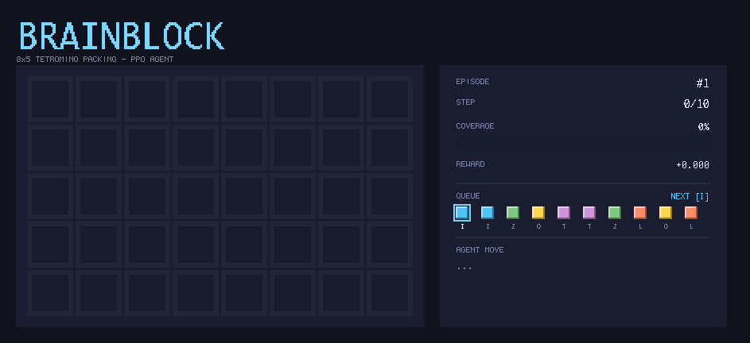

# BrainBlock — Deep RL for Tetromino Packing

Solve the **BrainBlock** puzzle using deep reinforcement learning.  
The agent must pack **10 tetrominoes** (I, O, L, Z, T — 2 of each) onto an **8 × 5** board without gaps.



---

## Problem

BrainBlock is a combinatorial tile-packing puzzle:

- **Board**: 8 columns × 5 rows = 40 cells
- **Pieces**: 10 tetrominoes drawn in a fixed random order (2× I, 2× O, 2× L, 2× Z, 2× T)
- **Goal**: place all pieces without overlap or out-of-bounds; fully cover all 40 cells
- **Action space**: 320 discrete actions — `orient × 40 + x × 5 + y` (8 orientations, 8 x-positions, 5 y-positions)

The search space is combinatorially large and most random placements quickly reach dead ends.

---

## Approach

Two parallel pipelines were implemented and compared:

| | PPO (Member A) | DQN (Member B) |
|---|---|---|
| Algorithm | Proximal Policy Optimization | Deep Q-Network |
| Encoder | MLP (256-dim) | MLP (256-dim) |
| Action masking | ✔ | ✔ |
| Reward | R1 sparse / **R2 shaped** | R1 sparse / **R2 shaped** |
| Exploration | entropy bonus (H=0.05) | ε-greedy decay |
| Diversity bonus | ✔ (+1 / novel tiling) | — |

### Reward shaping (R2)

Potential-based shaping is used to provide dense signal:

```
r = r_base + γ · Φ(s') − Φ(s)
Φ(s) = filled_cells / 40
```

This guides the agent toward high coverage without biasing the optimal policy (potential-based shaping preserves optimality by the Ng et al. theorem).

### Action masking

At every step the environment exposes a 320-bit mask of legal placements.  
The policy's logits are set to −∞ for illegal actions before the softmax, ensuring the agent **never wastes an episode on an out-of-bounds or overlapping placement**.

---

## Results

Training ran for **2 M timesteps** across 5 random seeds each.

| Model | Success rate | Coverage |
|---|---|---|
| PPO R2 + entropy + diversity (seed 42) | **~93–100 %** | ~99 % |
| PPO R1 sparse | ~15 % | ~80 % |
| DQN R2 shaped | ~67–72 % | ~94 % |
| DQN R1 sparse | < 5 % | ~77 % |

PPO with shaped rewards, entropy regularisation, and a diversity bonus is the best-performing configuration, consistently solving the board in 10 steps.

---

## Repository layout

```
common/         shared piece definitions & action codec
member_umut/    PPO pipeline  (environment, agent, network, train, evaluate)
member_goktug/  DQN pipeline  (environment, agent, network, train, evaluate)
results/        saved checkpoints & training metrics
report_figures/ figures used in the final report
terminal_demo.py  colourful terminal visualiser (see below)
```

---

## Quick start

```bash
# 1. create a virtual environment
python3 -m venv .venv && source .venv/bin/activate
pip install torch gymnasium numpy rich

# 2. run the terminal demo (PPO agent, auto-play)
python terminal_demo.py \
    --model results/ppo_r2_mlp_ent005_div1_seed42/best_model.pt \
    --speed 0.2

# 3. train from scratch
python -m member_umut.train \
    --reward shaped --encoder mlp --seed 42 \
    --total-timesteps 2000000

# 4. evaluate a checkpoint
python -m member_umut.evaluate \
    --model results/ppo_r2_mlp_ent005_div1_seed42/best_model.pt \
    --episodes 500
```

---

## Terminal demo flags

| Flag | Default | Description |
|---|---|---|
| `--model` | required | path to `.pt` checkpoint |
| `--speed` | `0.2` | seconds between steps |
| `--seed` | random | fix the episode seed |
| `--episodes` | `0` (∞) | stop after N episodes |
